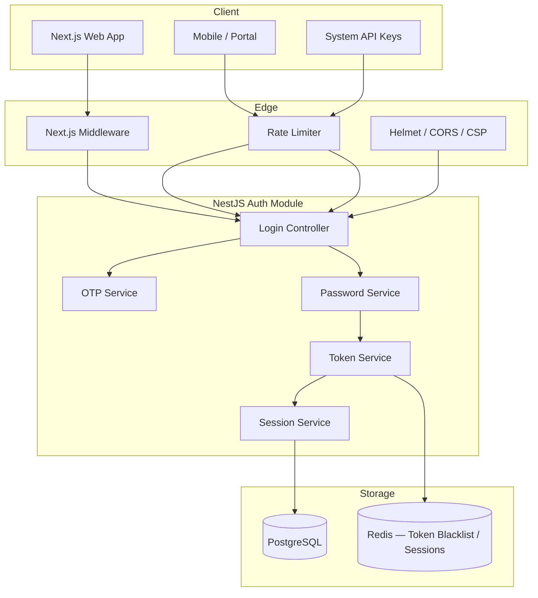
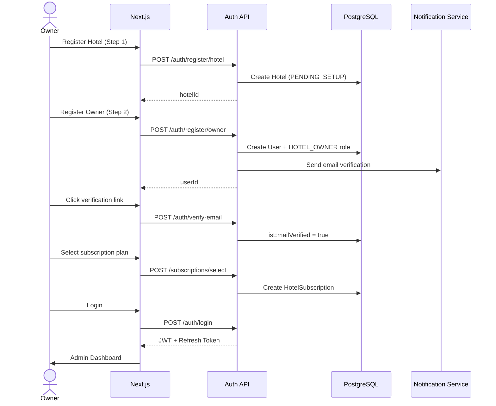
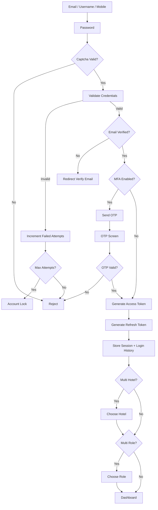
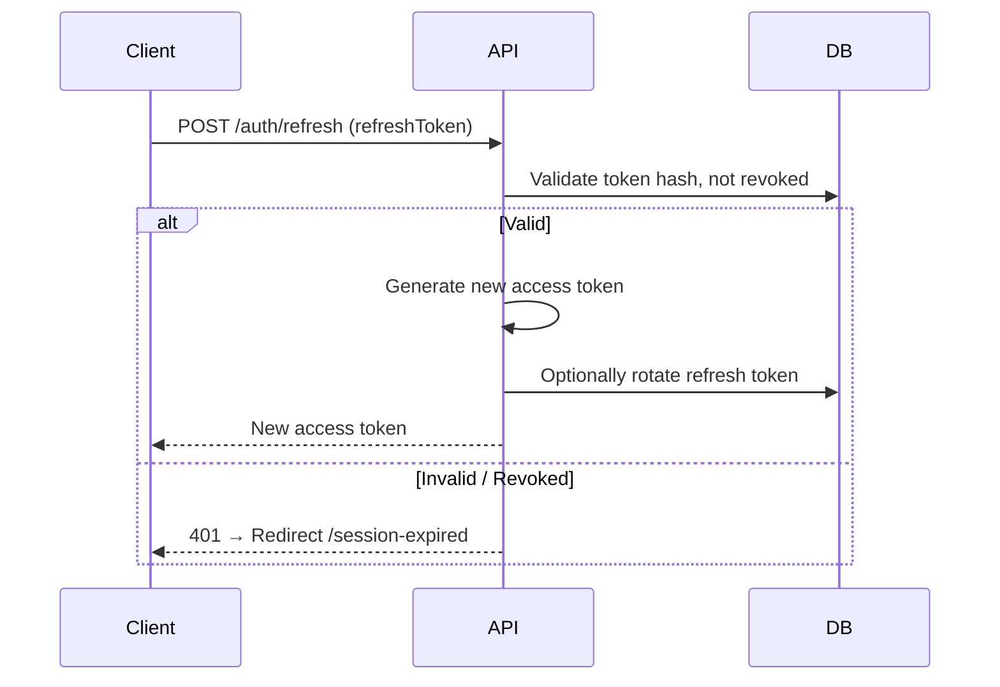
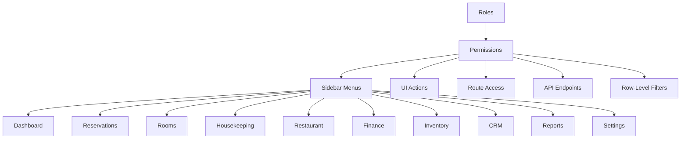
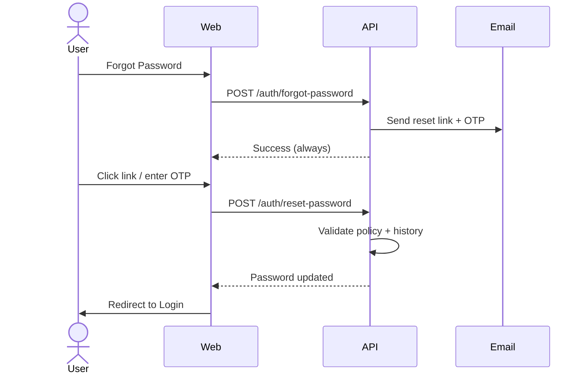

# TungaOS — Authentication & Authorization Architecture

**Version:** 1.0  
**Scope:** Identity, Access Management, RBAC, Session Security  
**Classification:** Enterprise Production Architecture

---

## 1. Executive Summary

TungaOS implements an enterprise-grade Identity and Access Management (IAM) system comparable to Oracle ERP, SAP, Salesforce, and Hotelogix. Every authenticated request validates **hotel_id**, **user_id**, **role**, **permissions**, and **subscription** before business logic executes.

---

## 2. Authentication Architecture



### 2.1 Multi-Tenant Login

| Actor | Hotel Scope | Cross-Tenant |
|-------|-------------|--------------|
| Super Admin | All hotels | Yes |
| Hotel Owner | Own hotel | No |
| Manager / Staff | Own hotel | No |
| Guest / Corporate | Assigned portal | No |

Every JWT embeds `hotelId`. The `HotelGuard` validates `x-hotel-id` header against token claims.

---

## 3. Registration Flow



---

## 4. Login Flow



---

## 5. JWT Architecture

### 5.1 Access Token Claims

```json
{
  "sub": "user-uuid",
  "email": "owner@hotel.com",
  "hotelId": "hotel-uuid",
  "roles": ["HOTEL_OWNER"],
  "permissions": ["dashboard:overview:read", "hotel:property:manage"],
  "iat": 1710000000,
  "exp": 1710000900
}
```

| Token | Expiry | Storage | Rotation |
|-------|--------|---------|----------|
| Access | 15 min | HttpOnly cookie + memory | On refresh |
| Refresh | 7 days (30 days Remember Me) | HttpOnly cookie | Rotated each refresh |

### 5.2 Refresh Flow



### 5.3 Token Revocation

- **Logout:** Revoke single refresh token
- **Logout All:** Revoke all user sessions + refresh tokens
- **Blacklist:** JWT `jti` stored in Redis + `token_blacklist` table until expiry
- **Password Change:** Force logout all devices

---

## 6. Session Management

| Mode | Behavior |
|------|----------|
| Single Device | Revoke previous sessions on new login |
| Multi Device | Allow N concurrent sessions (configurable) |
| Remember Me | Extended refresh token (30 days) |
| Session Timeout | 30 min inactivity → re-auth |
| Force Logout | Admin revokes user sessions |
| Inactive Expiry | Cron job cleans expired sessions |

---

## 7. RBAC Hierarchy



### 7.1 Permission Matrix (Sample)

| Role | Dashboard | Reservations | Finance | Settings | Manage Users |
|------|-----------|--------------|---------|----------|--------------|
| Super Admin | ✓ | ✓ | ✓ | ✓ | ✓ |
| Hotel Owner | ✓ | ✓ | ✓ | ✓ | ✓ |
| General Manager | ✓ | ✓ | Read | ✓ | ✓ |
| Receptionist | ✓ | ✓ | — | — | — |
| Finance | ✓ | Read | ✓ | — | — |
| Guest | Portal | Own bookings | — | — | — |

Full matrix defined in `@tungaos/shared/constants/permissions.ts`.

---

## 8. Forgot Password Flow



---

## 9. MFA Architecture

| Method | Status | Use Case |
|--------|--------|----------|
| Email OTP | Implemented | Default MFA |
| SMS OTP | Planned | Mobile-first staff |
| WhatsApp OTP | Planned | India market |
| Authenticator App | Planned | TOTP (Google Authenticator) |
| Recovery Codes | Planned | Account recovery |

---

## 10. Database Schema

### Core Identity Tables

| Table | Purpose |
|-------|---------|
| `users` | User accounts, MFA, lockout |
| `roles` | Hotel-scoped + system roles |
| `permissions` | module:resource:action keys |
| `role_permissions` | Role ↔ Permission mapping |
| `user_roles` | User ↔ Role ↔ Hotel |
| `refresh_tokens` | Hashed refresh tokens |
| `user_sessions` | Active session tracking |
| `oauth_accounts` | Google / future OAuth |
| `password_resets` | Reset + email verification tokens |
| `password_history` | Prevent password reuse |
| `otp_verifications` | OTP codes (hashed) |
| `login_history` | Login audit trail |
| `trusted_devices` | Device trust management |
| `api_keys` | System API authentication |
| `security_events` | Failed login, lockout, etc. |
| `token_blacklist` | Revoked JWT IDs |
| `audit_logs` | All CRUD + auth actions |

Schema files: `identity.prisma`, `auth-ext.prisma`, `logs.prisma`

---

## 11. API Structure

```
/api/v1/auth
├── POST   /login
├── POST   /refresh
├── POST   /logout
├── POST   /logout-all
├── POST   /register/hotel
├── POST   /register/owner
├── POST   /forgot-password
├── POST   /reset-password
├── POST   /verify-email
├── POST   /otp/send
├── POST   /otp/verify
├── POST   /select-hotel
├── POST   /select-role
├── GET    /me
└── GET    /google
```

### Middleware Stack

```
Request → Rate Limit → JWT Auth → Hotel Guard → Subscription Guard → Permissions Guard → Roles Guard → Controller
```

---

## 12. Backend Folder Structure

```
apps/api/src/
├── common/
│   ├── decorators/     auth.decorators, current-user
│   └── guards/         jwt, roles, permissions, hotel, subscription
├── modules/auth/
│   ├── auth.controller.ts
│   ├── auth.module.ts
│   ├── dto/
│   ├── services/       auth, token, password, otp
│   └── strategies/     jwt, google
└── infrastructure/database/
    ├── prisma.module.ts
    └── prisma.service.ts
```

---

## 13. Frontend Folder Structure

```
apps/web/src/
├── app/(auth)/
│   ├── login/
│   ├── register/
│   ├── forgot-password/
│   ├── reset-password/
│   ├── verify-email/
│   ├── otp/
│   ├── choose-hotel/
│   ├── choose-role/
│   └── auth/callback/
├── app/(dashboard)/dashboard/
├── app/unauthorized/
├── app/access-denied/
├── app/session-expired/
├── components/auth/    shell, otp, password, error-page
├── components/ui/      button, input, card, alert, loader
├── features/auth/
│   ├── components/   forms
│   ├── hooks/        useAuth
│   └── services/     auth.service
├── constants/routes.ts
└── middleware.ts
```

---

## 14. UI Screens

| Screen | Route | Connected To |
|--------|-------|--------------|
| Login | `/login` | Register, Forgot, Google, Dashboard |
| Register | `/register` | Login, Verify Email |
| Forgot Password | `/forgot-password` | Login, Reset Password |
| Reset Password | `/reset-password?token=` | Login |
| OTP | `/otp` | Dashboard |
| Verify Email | `/verify-email` | Login |
| Choose Hotel | `/choose-hotel` | Dashboard |
| Choose Role | `/choose-role` | Dashboard |
| OAuth Callback | `/auth/callback` | Dashboard |
| Dashboard | `/dashboard` | All modules |
| Unauthorized | `/unauthorized` | Login |
| Access Denied | `/access-denied` | Dashboard |
| Session Expired | `/session-expired` | Login |
| 404 | `not-found` | Home |
| 500 | `error` | Home |

---

## 15. Security Recommendations

1. **HTTPS only** in production; HSTS headers via Helmet
2. **HttpOnly + Secure + SameSite=Lax** cookies for tokens
3. **CSRF** protection on cookie-based auth (double-submit cookie)
4. **bcrypt** cost factor 12 for password hashing
5. **SHA-256** for refresh token and OTP hashing at rest
6. **Rate limiting** on login (10/min), OTP (3/min), forgot-password (5/min)
7. **Account lockout** after 5 failed attempts (15 min)
8. **Password policy:** 12+ chars, mixed case, number, special char, 90-day expiry
9. **Audit every auth event** to `login_history` + `security_events` + `audit_logs`
10. **IP + device fingerprinting** for suspicious activity detection

---

## 16. Enterprise Best Practices

- **Separation of concerns:** Auth module isolated from business modules
- **Shared validation:** Zod schemas in `@tungaos/shared` used by frontend and backend DTOs
- **Defense in depth:** Middleware (edge) + Guards (API) + DB row-level filters
- **Principle of least privilege:** Default deny; explicit permission grants
- **Zero trust:** Re-validate hotel context on every request
- **Immutable audit trail:** Append-only login history and audit logs

---

## 17. Future Scalability

| Feature | Approach |
|---------|----------|
| Microsoft / Apple / Facebook OAuth | Passport strategies + `oauth_accounts` |
| SAML / SSO | External IdP integration layer |
| Redis session store | Move token blacklist + active sessions to Redis cluster |
| Horizontal scaling | Stateless JWT + shared Redis + PostgreSQL read replicas |
| Microservices | Extract auth to dedicated IAM service with gRPC |
| ABAC | Attribute-based policies on top of RBAC |
| SCIM | User provisioning for enterprise HR systems |

---

## 18. Notifications

| Event | Channels |
|-------|----------|
| New Login | Email, In-App |
| Password Changed | Email, SMS |
| New Device | Email |
| Failed Login (3+) | Email |
| Account Locked | Email, SMS |
| OTP Generated | Email / SMS / WhatsApp |
| Password Reset | Email |

---

*Document maintained by TungaOS Security Architecture Team — Sharada Sama Solutions*
