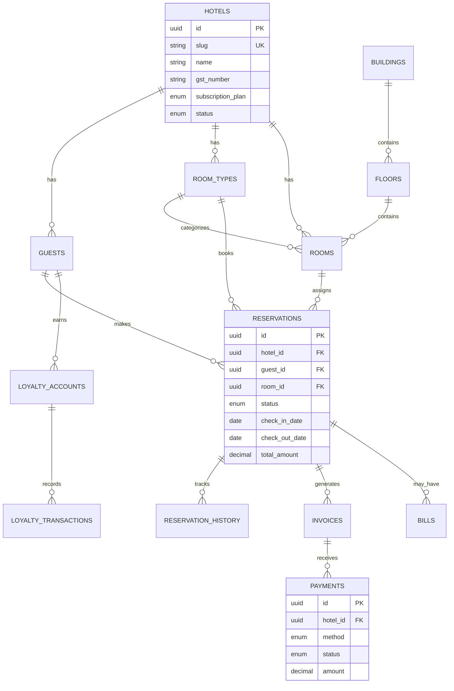
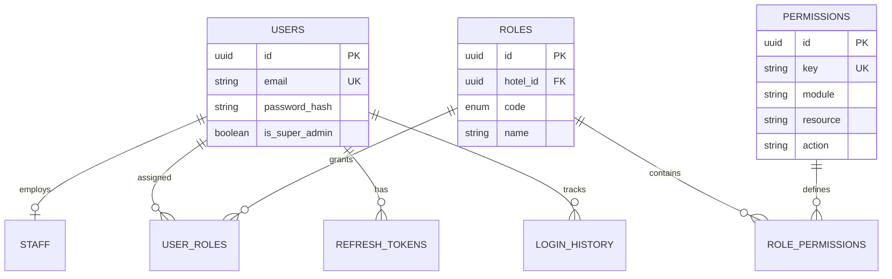
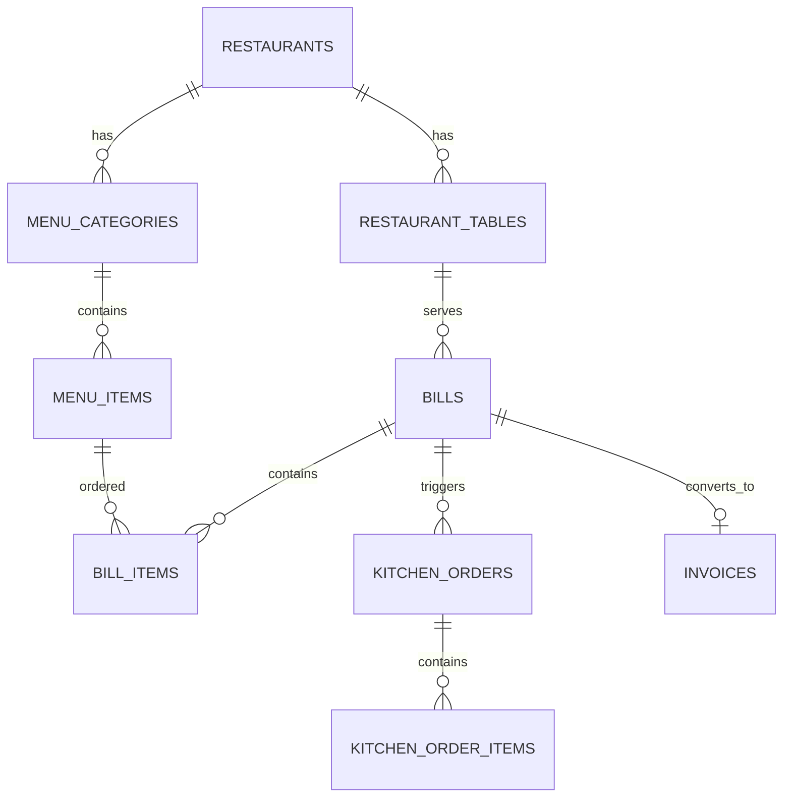
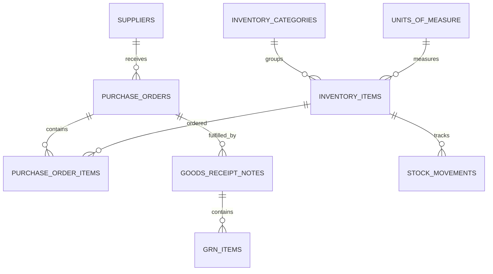

# TungaOS — Enterprise Database Architecture

**Version:** 1.0.0  
**Database:** PostgreSQL 16  
**ORM:** Prisma 6 (multi-file schema)  
**Schema Path:** `apps/api/prisma/schema/`  

---

## 1. Executive Summary

TungaOS uses a **shared-database, shared-schema multi-tenant** model. Every operational table includes `hotel_id` for tenant isolation. The schema supports **500+ hotels**, **10,000+ employees**, **500,000+ guests**, and **50M+ reservations** without structural redesign.

**Design principles:**
- UUID primary keys on all tables
- 3NF normalization with intentional denormalization only in cache/AI tables
- Soft deletes via `deleted_at` + `is_active`
- Full audit trail (`created_by`, `updated_by`, `version`)
- Module independence — new modules add tables, never alter existing ones
- File storage via URL references (S3 + CloudFront)

---

## 2. Schema Location

```
apps/api/prisma/schema/
├── schema.prisma      # Generator + datasource
├── enums.prisma       # 40+ domain enums
├── hotel.prisma       # Hotel master, settings, feature flags
├── identity.prisma    # Users, roles, permissions, auth
├── people.prisma      # Staff, guests, documents
├── property.prisma    # Buildings, floors, rooms, amenities
├── reservations.prisma# Reservations + history
├── operations.prisma  # Housekeeping, laundry, maintenance
├── fnb.prisma         # Restaurant, menu, bills, payments, loyalty
├── inventory.prisma   # Stock, PO, GRN, vendors
├── corporate.prisma   # Corporate, events, travel, parking
├── finance.prisma     # Accounts, payroll, HR attendance
├── crm.prisma         # CRM, marketing, offers, feedback
├── integrations.prisma# OTA, channel manager, AI, reports
└── logs.prisma        # Audit, API logs, files, secrets
```

**Commands:**
```bash
pnpm --filter @tungaos/api prisma:validate
pnpm --filter @tungaos/api prisma:generate
pnpm --filter @tungaos/api prisma:migrate
```

---

## 3. Multi-Tenancy Model

```
┌─────────────────────────────────────────────────────────┐
│                    PLATFORM LAYER                        │
│  users · roles · permissions · hotels (tenant root)      │
└──────────────────────────┬──────────────────────────────┘
                           │ hotel_id (FK, NOT NULL)
┌──────────────────────────▼──────────────────────────────┐
│                 TENANT-ISOLATED DATA                     │
│  guests · reservations · rooms · bills · inventory · …   │
│  EVERY query MUST filter: WHERE hotel_id = :hotelId      │
└─────────────────────────────────────────────────────────┘
```

| Rule | Implementation |
|------|----------------|
| Tenant root | `hotels` table — no `hotel_id` on self |
| Isolation column | `hotel_id UUID NOT NULL` on all operational tables |
| Super admin | `users.is_super_admin` — bypass with audit logging |
| Composite uniqueness | `@@unique([hotelId, code])` pattern |
| Soft delete | `deleted_at IS NULL` in all application queries |

---

## 4. Standard Audit Columns (Every Table)

| Column | Type | Purpose |
|--------|------|---------|
| `id` | UUID PK | Primary identifier |
| `hotel_id` | UUID FK | Tenant isolation (except platform tables) |
| `created_at` | TIMESTAMPTZ | Record creation |
| `updated_at` | TIMESTAMPTZ | Last modification |
| `deleted_at` | TIMESTAMPTZ? | Soft delete timestamp |
| `created_by` | UUID? | User who created |
| `updated_by` | UUID? | User who last updated |
| `deleted_by` | UUID? | User who soft-deleted |
| `is_active` | BOOLEAN | Active flag (default true) |
| `version` | INT | Optimistic locking counter |

---

## 5. Complete Module → Table Mapping (90 Modules)

| # | Module | Table(s) |
|---|--------|----------|
| 1 | Hotel Master | `hotels`, `hotel_subscriptions` |
| 2 | User Management | `users` |
| 3 | Roles | `roles` |
| 4 | Permissions | `permissions`, `role_permissions` |
| 5 | Authentication | `refresh_tokens`, `oauth_accounts`, `password_resets` |
| 6 | Staff | `staff` |
| 7 | Guests | `guests` |
| 8 | Guest Documents | `guest_documents` |
| 9 | Reservations | `reservations` |
| 10 | Reservation History | `reservation_history` |
| 11 | Room Types | `room_types` |
| 12 | Rooms | `rooms` |
| 13 | Room Amenities | `amenities`, `room_type_amenities` |
| 14 | Room Images | `room_images` |
| 15 | Floors | `floors` |
| 16 | Buildings | `buildings` |
| 17 | Housekeeping | `housekeeping_tasks` |
| 18 | Cleaning Checklist | `cleaning_checklists`, `cleaning_checklist_items` |
| 19 | Laundry | `laundry_orders`, `laundry_items` |
| 20 | Maintenance | `maintenance_requests` |
| 21 | Assets | `assets` |
| 22 | Restaurant | `restaurants` |
| 23 | Tables | `restaurant_tables` |
| 24 | Menu Categories | `menu_categories` |
| 25 | Menu Items | `menu_items` |
| 26 | Kitchen Orders | `kitchen_orders`, `kitchen_order_items` |
| 27 | Bills | `bills`, `bill_items` |
| 28 | Payments | `payments` |
| 29 | Taxes | `taxes` |
| 30 | Discounts | `discounts` |
| 31 | Coupons | `coupons` |
| 32 | Loyalty Points | `loyalty_programs`, `loyalty_accounts` |
| 33 | Loyalty Transactions | `loyalty_transactions` |
| 34 | Inventory | `inventory_items` |
| 35 | Categories | `inventory_categories` |
| 36 | Units | `units_of_measure` |
| 37 | Suppliers | `suppliers` |
| 38 | Purchase Orders | `purchase_orders`, `purchase_order_items` |
| 39 | Purchase Items | *(purchase_order_items)* |
| 40 | Goods Receipt Note | `goods_receipt_notes`, `grn_items` |
| 41 | Stock Movement | `stock_movements` |
| 42 | Vendors | `vendors` |
| 43 | Corporate Companies | `corporate_companies` |
| 44 | Corporate Contracts | `corporate_contracts` |
| 45 | Corporate Employees | `corporate_employees` |
| 46 | Corporate Bookings | `corporate_bookings` |
| 47 | Event Management | `events` |
| 48 | Banquet Booking | `banquet_bookings` |
| 49 | Travel Desk | `travel_desk_requests` |
| 50 | Vehicles | `vehicles` |
| 51 | Airport Pickup | `airport_pickups` |
| 52 | Parking | `parking_slots`, `parking_records` |
| 53 | Finance | `accounts`, `journal_entries`, `journal_lines` |
| 54 | Expense Categories | `expense_categories` |
| 55 | Expenses | `expenses` |
| 56 | Income | `incomes` |
| 57 | Accounts | `accounts` |
| 58 | Journal Entries | `journal_entries`, `journal_lines` |
| 59 | Payroll | `payroll_runs`, `payroll_lines` |
| 60 | Salary Components | `salary_components` |
| 61 | Attendance | `attendance_records` |
| 62 | Leaves | `leave_requests` |
| 63 | Employee Shifts | `shifts`, `staff_shifts` |
| 64 | Notifications | `notifications` |
| 65 | WhatsApp Logs | `whatsapp_logs` |
| 66 | Email Logs | `email_logs` |
| 67 | SMS Logs | `sms_logs` |
| 68 | Feedback | `feedbacks` |
| 69 | Reviews | `reviews` |
| 70 | Complaints | `complaints` |
| 71 | CRM | `crm_leads`, `crm_activities` |
| 72 | Marketing Campaigns | `marketing_campaigns` |
| 73 | Offers | `offers` |
| 74 | OTA Integrations | `ota_integrations` |
| 75 | Channel Manager | `channel_mappings` |
| 76 | Dynamic Pricing | `dynamic_price_rules` |
| 77 | AI Predictions | `ai_predictions` |
| 78 | AI Revenue Forecast | `ai_revenue_forecasts` |
| 79 | AI Recommendation Logs | `ai_recommendation_logs` |
| 80 | Reports | `report_definitions`, `report_runs` |
| 81 | Dashboard Cache | `dashboard_cache` |
| 82 | Audit Logs | `audit_logs` |
| 83 | Activity Logs | `activity_logs` |
| 84 | Login History | `login_history` |
| 85 | API Logs | `api_logs` |
| 86 | Error Logs | `error_logs` |
| 87 | File Storage | `stored_files` |
| 88 | Attachments | `attachments` |
| 89 | Settings | `hotel_settings` |
| 90 | Feature Flags | `feature_flags` |

**Additional tables:** `encrypted_secrets`, `user_roles`, `invoices`, `staff_documents`

**Total:** 95+ tables across 14 schema files.

---

## 6. Core ER Diagram — Reservation Flow



---

## 7. Identity & RBAC ER Diagram



**Permission key format:** `module:resource:action` (e.g. `booking:reservation:create`)

---

## 8. F&B & POS ER Diagram



---

## 9. Inventory & Procurement ER Diagram



---

## 10. Relationship Types

| Type | Example | Implementation |
|------|---------|----------------|
| One-to-One | Guest ↔ LoyaltyAccount | `@unique` on FK |
| One-to-Many | Hotel → Rooms | FK on child |
| Many-to-Many | Roles ↔ Permissions | `role_permissions` junction |
| Many-to-Many | RoomTypes ↔ Amenities | `room_type_amenities` junction |
| Self-referential | Account hierarchy | `parent_id` FK to same table |
| Self-referential | Inventory category tree | `parent_id` on categories |
| Polymorphic | Attachments | `entity_type` + `entity_id` |
| Optional | Reservation → Room | Nullable `room_id` until check-in |

---

## 11. Constraints Summary

| Constraint Type | Examples |
|-----------------|----------|
| Primary Keys | `id UUID` on every table |
| Foreign Keys | All `hotel_id`, entity FKs with `onDelete` strategy |
| Unique | `[hotelId, code]`, `[hotelId, reservationCode]` |
| Composite Unique | `[hotelId, staffId, date]` on attendance |
| Check (app-level) | Amounts ≥ 0, dates logical — enforce in services |
| Partial Index | `WHERE deleted_at IS NULL` (recommended in migrations) |

**Cascade strategy:**
- `Cascade` — child records of tenant (hotel settings, bill items)
- `Restrict` — financial/inventory references (room types, accounts)
- `SetNull` — optional associations (assigned staff, room on reservation)

---

## 12. Index Strategy

### Mandatory indexes (all tenant tables)
```sql
CREATE INDEX idx_<table>_hotel_id ON <table> (hotel_id);
CREATE INDEX idx_<table>_hotel_active ON <table> (hotel_id) WHERE deleted_at IS NULL;
```

### High-traffic query indexes
| Table | Index | Query Pattern |
|-------|-------|---------------|
| `reservations` | `(hotel_id, check_in_date, check_out_date)` | Availability search |
| `reservations` | `(hotel_id, status)` | Front desk dashboard |
| `reservations` | `(hotel_id, guest_id)` | Guest history |
| `rooms` | `(hotel_id, status)` | Room rack / housekeeping |
| `guests` | `(hotel_id, phone)`, `(hotel_id, email)` | Guest lookup |
| `payments` | `(hotel_id, created_at DESC)` | Finance reports |
| `stock_movements` | `(hotel_id, item_id, movement_date DESC)` | Inventory ledger |
| `audit_logs` | `(hotel_id, created_at DESC)` | Compliance audit |
| `login_history` | `(user_id, created_at DESC)` | Security monitoring |

### Full-text search (future)
```sql
CREATE INDEX idx_guests_search ON guests USING gin(
  to_tsvector('english', first_name || ' ' || last_name || ' ' || coalesce(email,''))
);
```

---

## 13. Performance Optimization

### Partitioning (at scale)
| Table | Strategy | When |
|-------|----------|------|
| `reservations` | RANGE by `check_in_date` (yearly) | > 10M rows |
| `audit_logs` | RANGE by `created_at` (monthly) | > 50M rows |
| `api_logs` | RANGE by `created_at` (weekly) | > 100M rows |
| `payments` | RANGE by `created_at` (yearly) | > 20M rows |

### Materialized views
```sql
-- Daily occupancy snapshot per hotel
CREATE MATERIALIZED VIEW mv_daily_occupancy AS
SELECT hotel_id, check_in_date AS date,
       COUNT(*) FILTER (WHERE status IN ('CONFIRMED','CHECKED_IN')) AS occupied,
       COUNT(DISTINCT room_id) AS rooms_assigned
FROM reservations WHERE deleted_at IS NULL
GROUP BY hotel_id, check_in_date;
```

### Caching strategy
| Layer | Data | TTL |
|-------|------|-----|
| Redis | Dashboard KPIs | 60s |
| Redis | Room status board | 30s |
| `dashboard_cache` table | Report widgets | 5–15 min |
| CDN | Room images, logos | 24h |

### Pagination
- Always use `LIMIT/OFFSET` with `ORDER BY created_at DESC`
- For deep pagination (>10k): keyset pagination on `(created_at, id)`
- Default page size: 20, max: 100

---

## 14. Security — Encrypted Fields

| Field | Table | Method |
|-------|-------|--------|
| `password_hash` | `users` | bcrypt (cost 12) |
| `token_hash` | `refresh_tokens`, `password_resets` | SHA-256 hash of token |
| `mfa_secret` | `users` | AES-256-GCM encrypted |
| `api_key_encrypted` | `ota_integrations` | AES-256-GCM |
| `access_token`, `refresh_token` | `oauth_accounts` | AES-256-GCM |
| All API keys/secrets | `encrypted_secrets` | AES-256-GCM with KMS |

**Recommendations:**
- Use AWS KMS or HashiCorp Vault for key management
- Never store plaintext passwords or refresh tokens
- Rotate JWT secrets quarterly
- Row-level security (PostgreSQL RLS) as defense-in-depth for `hotel_id`

---

## 15. File Storage Design

All files stored in **AWS S3** with **CloudFront** CDN. Database stores URLs only.

| Category | `FileCategory` enum | Typical path |
|----------|---------------------|--------------|
| Guest photos | `GUEST_PHOTO` | `/{hotel_id}/guests/{id}/photo.jpg` |
| Guest IDs | `GUEST_ID` | `/{hotel_id}/guests/{id}/documents/` |
| Room images | `ROOM_IMAGE` | `/{hotel_id}/rooms/{type_id}/` |
| Hotel logo | `HOTEL_LOGO` | `/{hotel_id}/brand/logo.png` |
| Invoices PDF | `INVOICE` | `/{hotel_id}/invoices/{year}/` |
| Contracts | `CONTRACT` | `/{hotel_id}/contracts/` |

`attachments` table provides polymorphic linking to any entity.

---

## 16. Scaling Strategy

| Phase | Hotels | Strategy |
|-------|--------|----------|
| 1 | 1–100 | Single PostgreSQL, PgBouncer, Redis cache |
| 2 | 100–500 | Read replicas, table partitioning on logs |
| 3 | 500+ | Partition reservations by date, dedicated analytics DB |
| Enterprise | Custom | Schema-per-tenant or dedicated RDS per hotel |

**Connection pooling:** PgBouncer transaction mode, max 100 connections per API instance.

---

## 17. Backup & Disaster Recovery

| Component | RPO | RTO | Method |
|-----------|-----|-----|--------|
| PostgreSQL | 5 min | 1 hour | RDS automated backups + PITR |
| Redis | 1 hour | 15 min | ElastiCache snapshots |
| S3 files | 0 | 1 hour | Cross-region replication |
| Full DR | 1 hour | 4 hours | Cross-region RDS replica failover |

**Backup schedule:**
- Continuous WAL archiving
- Daily full backup retained 30 days
- Weekly backup retained 1 year
- Monthly compliance archive to cold storage

---

## 18. Future Expansion

New modules add new tables with `hotel_id` — **never modify existing tables**.

```prisma
// Example: adding QR Room Service module
model QrOrder {
  id      String @id @default(uuid()) @db.Uuid
  hotelId String @map("hotel_id") @db.Uuid
  // ... standard audit fields
  // ... module-specific columns
}
```

Register in `hotel_subscriptions.enabled_modules` and `feature_flags`.

---

## 19. Best Practices

1. **Every query includes `hotel_id`** — enforced in repository base class
2. **Soft delete only** — never `DELETE` operational data
3. **Optimistic locking** — check `version` on updates
4. **Money as DECIMAL(14,2)** — never FLOAT for currency
5. **Timestamps as TIMESTAMPTZ** — store UTC, display in hotel timezone
6. **Enums for status fields** — Prisma enums map to PostgreSQL enums
7. **JSON for flexible metadata** — not for relational data
8. **Migration-only schema changes** — never manual DDL in production

---

## 20. Enum Reference

All enums defined in `enums.prisma`:

`ReservationStatus`, `BookingSource`, `RoomStatus`, `HousekeepingStatus`, `EmployeeStatus`, `PaymentStatus`, `PaymentMethod`, `InvoiceStatus`, `Gender`, `TaxType`, `MaintenancePriority`, `MaintenanceStatus`, `LeaveStatus`, `NotificationType`, `NotificationStatus`, `ComplaintStatus`, `CouponType`, `DiscountType`, `LoyaltyType`, `MembershipTier`, `ShiftType`, `UserRoleType`, and 25+ additional domain enums.

---

*Schema validated with `prisma validate --schema prisma/schema`. See Prisma files for complete column definitions and relations.*
